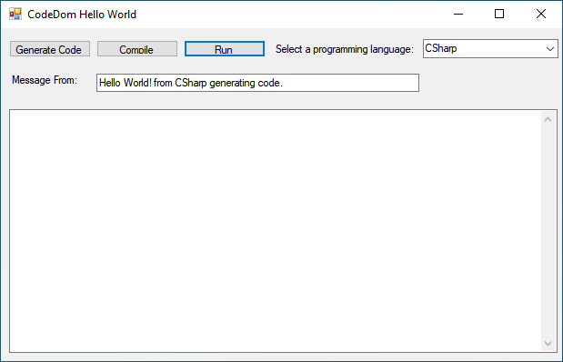

# Generating Managed Code with CSharp

Using CodeDom with JavaScrip, CSharp and Visual Basic.Net Providers

- WinForm To 
- Generate Code
- Compile
- Run
- Select Providers: CSharp, Visual Basic.Net and JavaScript


Win Form



## Generate Code

```csharp
private void generate_button_Click(object sender, EventArgs e)
{
    CodeDomProvider provider = GetCurrentProvider();
    CodeDomExample.GenerateCode(provider, 
    CodeDomExample.BuildHelloWorldGraph(HelloWordFrom.Text));
    // Build the source file name with the appropriate language extension.
    String sourceFile;
    if (provider.FileExtension[0] == '.')
        sourceFile = "TestGraph" + provider.FileExtension;
    else
        sourceFile = "TestGraph." + provider.FileExtension;
    // Read in the generated source file and display the source text.
    StreamReader sr = new StreamReader(sourceFile);             
    textBox1.Text = sr.ReadToEnd();
    sr.Close();
}
private CodeDomProvider GetCurrentProvider()
{
    return ((string)this.comboBox1.SelectedItem) switch
    {
            "Visual Basic" => CodeDomProvider.CreateProvider("VisualBasic"),
            "JScript" => CodeDomProvider.CreateProvider("JScript"),
            null => CodeDomProvider.CreateProvider("CSharp"),
            _ => CodeDomProvider.CreateProvider("CSharp"),
    };
}
```

## Compile Code

```Csharp
private void compile_button_Click(object sender, EventArgs e)
{
    CodeDomProvider provider = GetCurrentProvider();
    // Build the source file name with the appropriate language extension.
    String sourceFile;                                              
    if (provider.FileExtension[0] == '.')
        sourceFile = "TestGraph" + provider.FileExtension;
    else
        sourceFile = "TestGraph." + provider.FileExtension;
    // Compile the source file into an executable output file.
    CompilerResults cr = CodeDomExample.CompileCode(provider,       
                                                    sourceFile,
                                                    "TestGraph.exe");
    if (cr.Errors.Count > 0)
    {
		// Display compilation errors.
        textBox1.Text = "Errors encountered while building " +      
            sourceFile + " into " + cr.PathToAssembly + ": \r\n\n";
        foreach (CompilerError ce in cr.Errors)
            textBox1.AppendText(ce.ToString() + "\r\n");
        run_button.Enabled = false;
    }
    else
    {
        textBox1.Text = "Source " + sourceFile + " built into " +
            cr.PathToAssembly + " with no errors.";
        run_button.Enabled = true;
    }
}
```

## Run Code

```csharp
private void run_button_Click(object sender, EventArgs e)
{
	Process.Start("TestGraph.exe");
}
```

